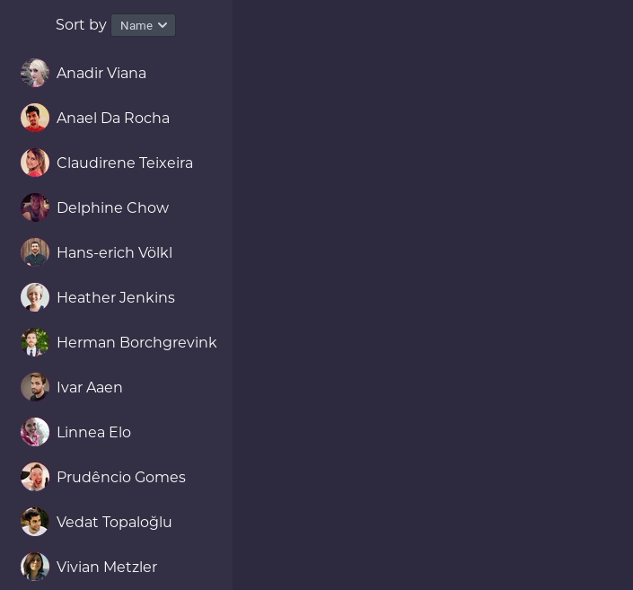

# Web App Boilerplate

- **preact** for rendering and component-ing
- **mobx** with **mobx-state-tree** for state management
- **babel** configured to handle typescript and latest ES syntax
- **typescript** for typechecking (VSCode or `npm test`)
- **tslint**, **stylelint** and **prettier** for formatting (VSCode or `npm run format`)
- [**pwa-serve**](https://www.npmjs.com/package/pwa-serve) as development server
- **rollup** as production bundler
- Includes VSCode config and recommended extensions.
- Production build outputs javascript modules (`<script type="module">`)

## How to

Run `npm i` and then `npm start` to start developing with live reload.

To build for production run `docker build . -t $IMAGE_NAME` and start it with `docker run $IMAGE_NAME`.

You can also manually run `npm run build` and then serve repo directory with nginx or apache
(remember to configure index fallback and optionally forbid `src` and `node_modules`).

## Known issues

- Reordering animation is wrong (because preact alpha)
- Production build fails (because preact alpha?)
